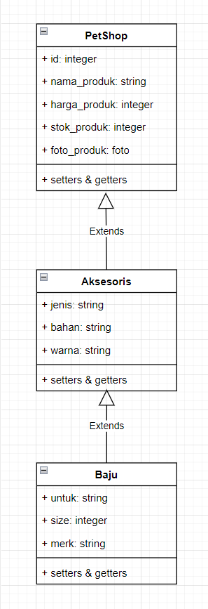
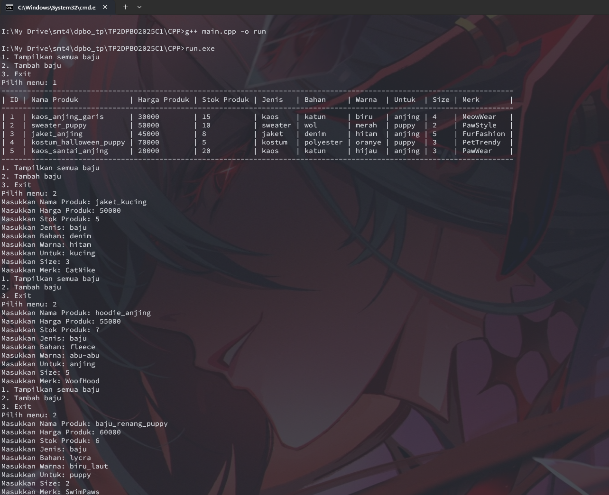
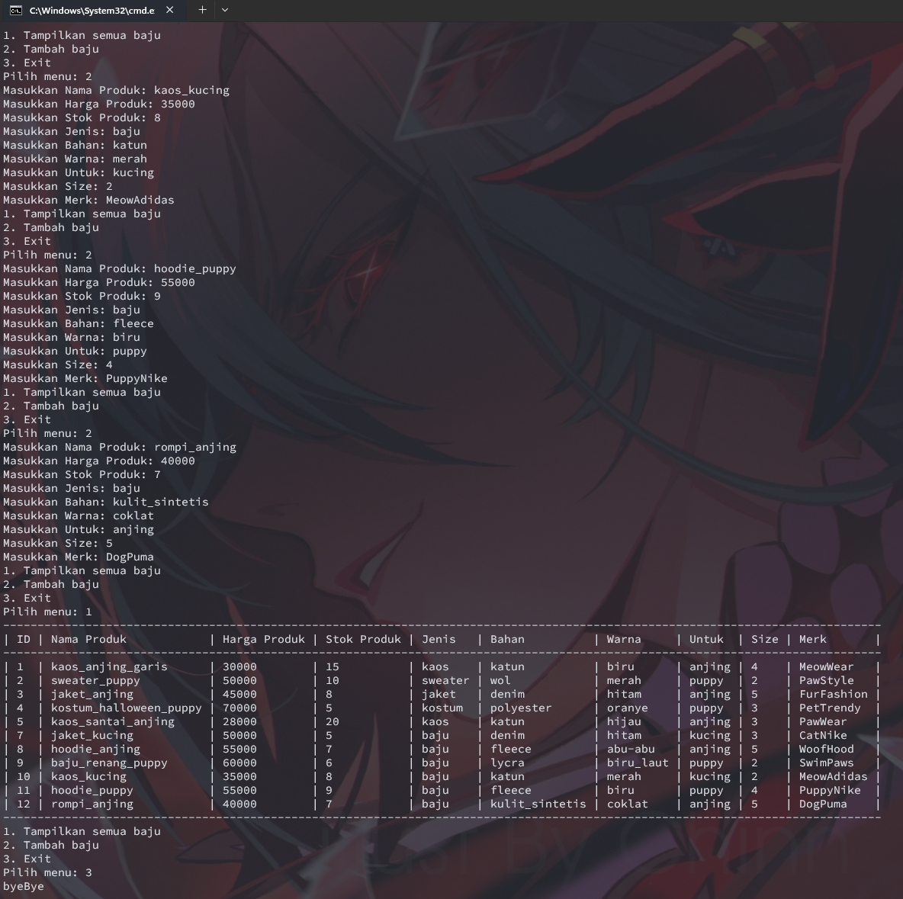
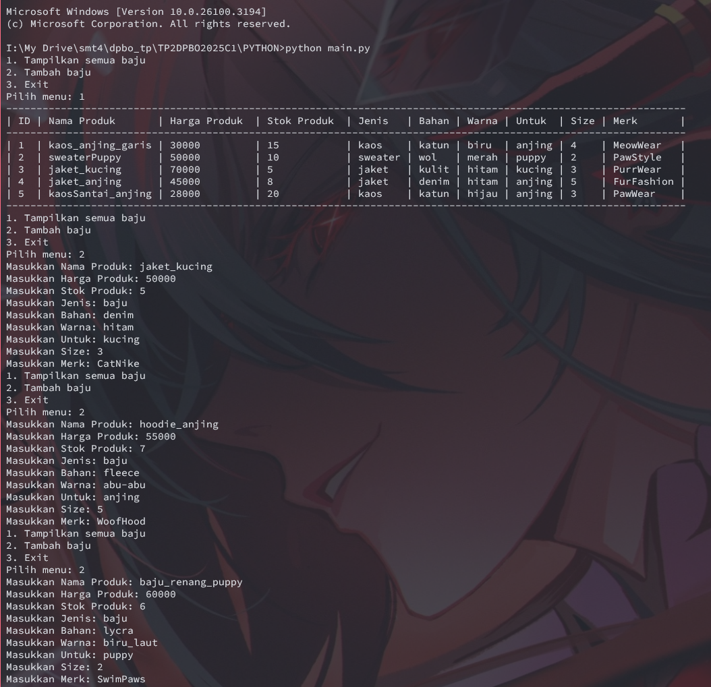
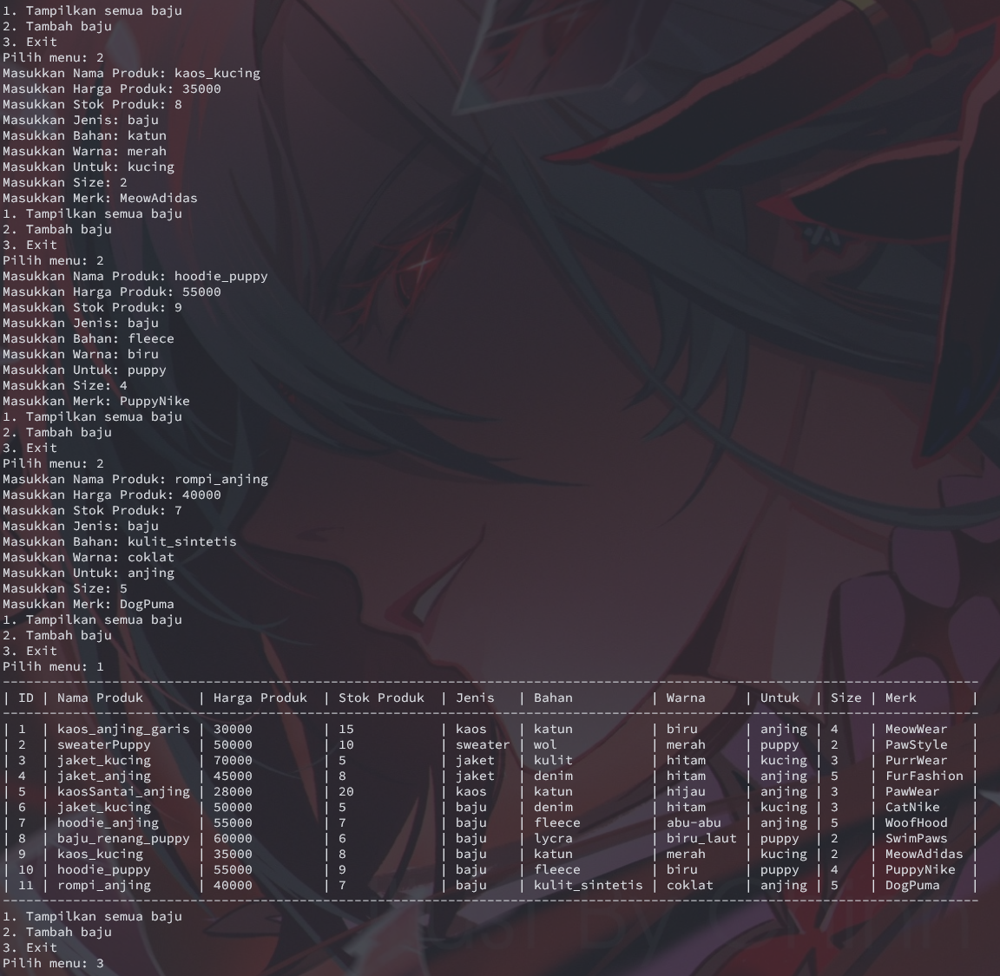
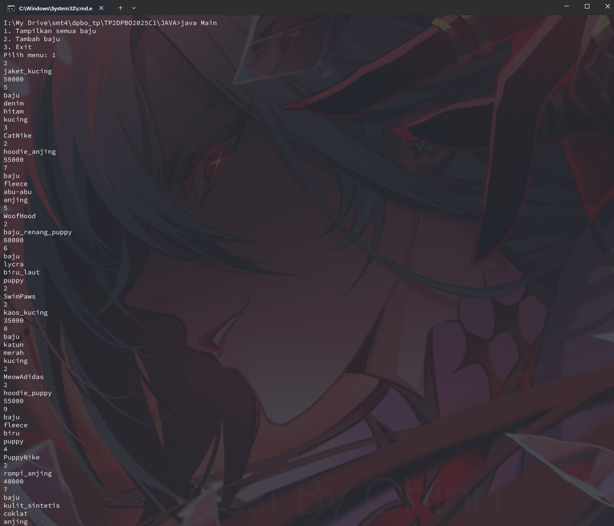
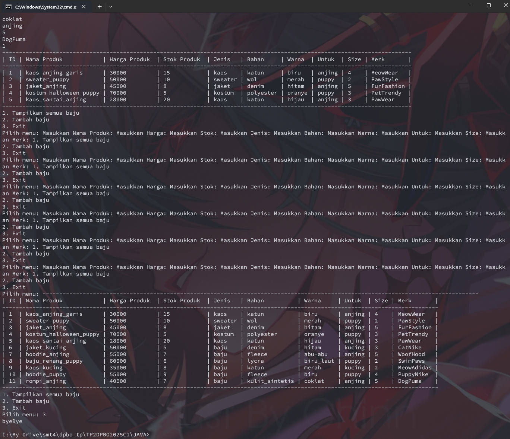
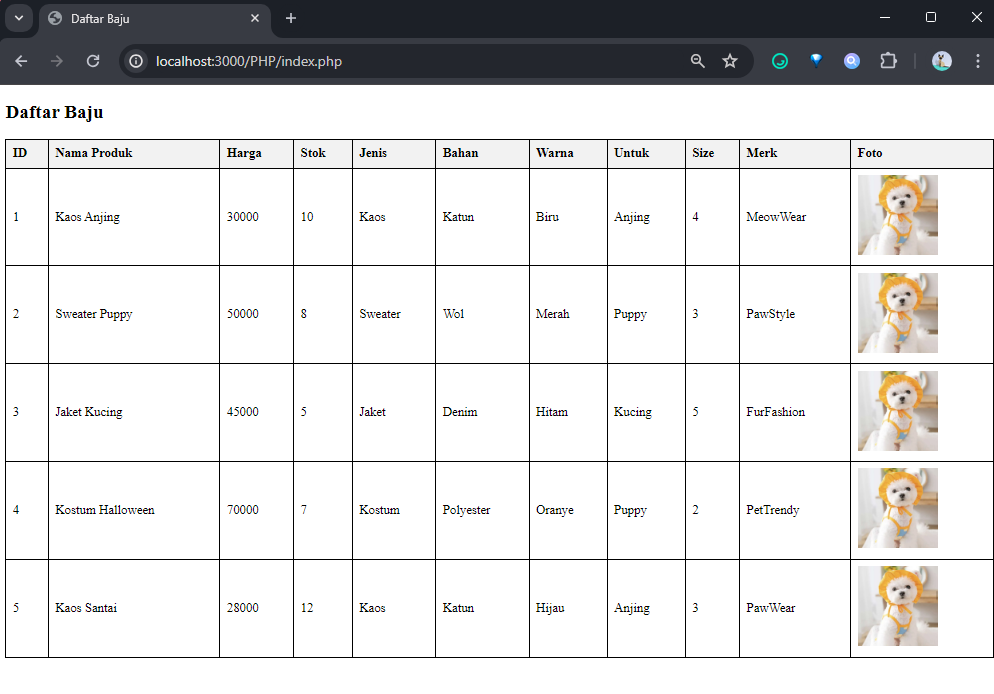

# Janji 
Saya Yusrilia Hidayanti dengan NIM 2306828 mengerjakan Tugas Praktikum 2 dalam mata kuliah Desain dan Pemrograman Berorientasi Objek untuk keberkahanNya maka saya tidak melakukan kecurangan seperti yang telah dispesifikasikan. Aamiin.

# Diagram
Berikut adalah diagram kelas:

# Atribut & Methods
## Struktur Kelas
### 1. Kelas PetShop
Atribut:
- `id`: ID unik produk
- `namaProduk`: Nama produk
- `hargaProduk`: Harga produk
- `stokProduk`: Jumlah stok tersedia
- `fotoProduk`: Path foto produk (khusus PHP)

Metode:
- setters & getters untuk setiap atribut

### 2. Kelas Aksesoris (Turunan PetShop)

Atribut tambahan:
- `jenis`: Jenis aksesoris
- `bahan`: Bahan aksesoris
- `warna`: Warna aksesoris

Metode:
- setters & getters untuk setiap atribut

### 3. Kelas Baju (Turunan Aksesoris)
Atribut tambahan:
- `untuk`: Untuk hewan apa (anjing, kucing, etc)
- `size`: Ukuran baju
- `merk`: Merek baju

Metode:
- setters & getters untuk setiap atribut

# Alur Program 
## C++, Java & Python
Alur **program C++, Java** dan **Python** sama, yaitu program akan membuat list baju dan mengisi list tersebut dengan 5 buah data, lalu menampilkan menu sederhana yang berisi pilihan:
1. Tampilkan semua baju
2. Tambah baju
3. Exit

Fungsi dari masing-masing pilihan menu adalah:
1. Menampilkan tabel dinamis dari data yang ada
3. Meminta user untuk memasukkan data untuk menambah data baju baru
3. Keluar dari program

## PHP
Alur program **PHP** adalah menambahkan 5 data baju secara statis (hardcode) lalu menampilkannya dalam tabel html.

# Dokumentasi

Untuk bahasa C++, Java dan Python, berikut adalah hasil run program menggunakan input.txt yang di copy-paste ke command line, lalu untuk PHP, berikut adalah tampilan dari index.php:

## C++

## Python

## Java

## PHP

